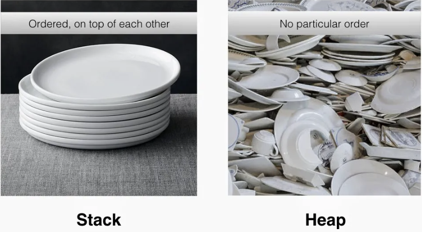

# Pointers

## What is a Pointer?

A pointer is a variable that holds a memory address. In C++, pointers are typed, meaning a pointer to an int (written as `int*`) is distinct from a pointer to a double (written as `double*`). This type information is crucial for pointer arithmetic and dereferencing, enabling the compiler to correctly interpret the data at the pointed-to location.

## Stack vs. Heap

Understanding pointers requires a grasp of how memory is organized. The two primary regions are the **stack** and the **heap**:

### The Stack (Automatic & Orderly Memory)

Think of the stack like a stack of plates or a deck of cards. When you call a function, a new "plate" called a **stack frame** which is placed on top of the pile. This frame holds all the local variables and parameters for that function.

This process is fast, orderly, and most importantly, **automatic**. When the function finishes, its plate is immediately taken off the top, and all the memory it used is instantly freed. This is why local variables are sometimes called "automatic variables."

- **Automatic Management**: The compiler handles allocation and deallocation on the stack. Memory is allocated when a function is entered and automatically freed when the function returns. This is managed through a simple stack pointer that is incremented and decremented.

- **Fast Access:** Stack access is extremely fast because memory addresses are typically known at compile time, and the LIFO (Last-In, First-Out) structure allows for straightforward allocation and deallocation.

- **Limited Size**: The stack size is relatively small (compared to the heap) and fixed at compile time. The exact size can often be configured through compiler settings or operating system limits.

- **Stack Overflow**: Exceeding the stack's capacity (e.g., through excessively deep recursion or very large local variables) leads to a stack overflow error, usually causing program termination.

```c++
void myFunction() {
    int x = 10; // 'x' lives on the stack, in myFunction's "plate".
    // ... do stuff with x ...
} // When myFunction ends, its plate is removed. 'x' is automatically destroyed. No cleanup needed.
```

### Heap (Manual & Flexible Memory)

The heap is a large, less-structured pool of memory available for your program to use when you need data to live longer than a single function call or when its size isn't known at compile time.

Think of it as a large, open warehouse where you can request a storage space of any size. You request space using the new keyword, and you get back a pointer (an address) to your reserved spot.

- **Manual Control**: Unlike the stack, memory on the free store is not managed automatically. You are responsible for both allocation (`new`) and deallocation (`delete`).

- **Forgetting to `delete` causes Memory Leaks**: If you request memory with ne`w and forget to release it with `delete`, that memory becomes unusable for the rest of the program's duration. This is a **memory leak**.

- **Larger Size**: The free store is typically much larger than the stack, limited only by the available system memory.

- **Slower Access**: Allocation and deallocation are slower. The system has to search for a free block of the right size, which takes more time than simply moving the stack pointer.

- **Fragmentation**: Over time, as you allocate and deallocate blocks of different sizes, the free space in the "warehouse" can become broken up into small, non-contiguous chunks. This is called fragmentation, and it can make it difficult to find a large enough single block for a new allocation, even if there's enough total free space

The heap is used for dynamic memory allocation, and allows you to allocate memory explicitly during runtime. Unlike the stack, the heap does not automatically deallocate memory—you have to do it manually. If you forget to deallocate memory when you're done with it, it can lead to memory leaks. The heap is larger than the stack, but allocating and deallocating memory on the heap is slower than on the stack.

```c++
void createLeakyData() {
    // Request memory for 50 ints on the free store.
    int* myData = new int[50];
    // ... do stuff with myData ...

} // myData (the pointer on the stack) is destroyed, but the memory
  // it pointed to on the free store is NOT released! It's now leaked.
  // You should always use the delete keyword!
```



## Why and when to use pointers?

Pointers are not merely about storing addresses; they are about enabling powerful programming techniques. Here's a more nuanced look at their purpose:

- **Efficient Data Manipulation:**  Passing large objects (like `structs` or `classes`) directly to functions can be slow due to copying. Pointers offer a solution by passing only the memory address, avoiding expensive copy operations.
  - **Example**: Passing a large image object to a function for processing. Instead of copying the entire image, you pass a pointer to it.
- **Dynamic Memory Allocation**: When the size of data is unknown at compile time, or if you need data to persist beyond the scope of a function, pointers are essential. They allow you to allocate memory on the heap using `new` (or `new[]` for arrays), giving you flexibility and control over the lifetime of your data.

## Types of Pointers in C++

While the concept of a pointer is simple, C++ provides different "flavors" of pointers, each with a specific purpose.

### 1. Raw Pointers

This is the most basic form of a pointer, inherited from C. It's a simple variable that holds a memory address and provides no automatic memory management.

#### Pros:

- Fast and lightweight with no overhead.
- Necessary for low-level hardware interaction and interfacing with C libraries.

#### Cons:

- **Unsafe**: They are the primary source of memory leaks and dangling pointers.
- **No Ownership Semantics**: It's unclear who is responsible for deleting the pointed-to memory.

### 2. Smart Pointers (Modern C++)

Smart pointers are class objects that wrap a raw pointer and manage the lifetime of the pointed-to memory automatically using the **RAII (Resource Acquisition Is Initialization)** principle. When the smart pointer object goes out of scope, its destructor is called, which in turn deletes the raw pointer. This prevents most common memory leaks.

- `std::unique_ptr`: Represents exclusive ownership. Only one `unique_ptr` can point to an object at a time. It's very lightweight and should be your default choice.
- `std::shared_ptr`: Represents shared ownership. Multiple `shared_ptrs` can point to the same object. The object is deleted only when the last `shared_ptr` pointing to it is destroyed.
- `std::weak_ptr`: A non-owning "observer" of a `shared_ptr`. It's used to break circular dependency cycles that can occur with `std::shared_ptr`.

General Rule: In modern C++, you should prefer smart pointers over raw pointers for managing the lifetime of dynamically allocated objects.

## How to use pointers?

C++ has three fundamental operators for working with pointers and memory addresses:

1. **Declaration** (`*`): Used when declaring a pointer variable. The preferred syntax is `int* ptr;` to clearly associate the `*` with the type.
2. **Address-of** (`&`): Gets the memory address of an existing variable.
```c++
int x = 25; 
int* ptr = &x; // 'ptr' now holds the memory address of 'x'.
```
3. **Dereference** (`*`): Accesses the value at the memory address the pointer is holding.
```c++
int y = *ptr; // 'y' is now 25. 
*ptr = 30;    // 'x' is now 30.
```

### 1. Declare The Pointer Using  (`*`)

Use `*` when you want to create a pointer to an object or when you want to access the value the pointer is pointing to. Pointers are useful when you need to pass an object to a function without making a copy, but you also need the flexibility of being able to change what the pointer points to.

```c++
int* ptr;  // Declares a pointer named ptr
```

There are three ways to declare pointer variables, but the first way is preferred:

```c++
int* ptr; // Preferred  
int *ptr;  
int * ptr;
```

### 2. The Address-of Operator (`&`):

**Purpose**: Gets the memory address of a variable.

```c++
int x = 25; 
int* ptr = &x; // 'ptr' now holds the memory address of 'x'.
```

In this example, `&x` gives the memory address of `x`, and `ptr` stores this address. The `*` symbol is used to declare a pointer, and the `&` symbol is used to get the memory address of a variable.

This following example shows the same principle again (value vs pointer address):

```c++
string food = "Pizza"; // A food variable of type string  
cout << food;  // Outputs the value of food (Pizza)  
cout << &food; // Outputs the memory address of food (**0x6dfed4**)
```

### 3. The Dereference Operator (`*`)

The dereference operator is the asterisk (`*`). When the `*` is placed before the name of a pointer variable, it dereferences the pointer, i.e., it retrieves the value stored at the memory address held by the pointer.

```c++
int x = 25; 
int* ptr = &x; 
int y = *ptr; // 'y' now holds the value 25 (the value pointed to by 'ptr').
```

**Modifying Values**: You can use the dereference operator to change the value the pointer points to:

```c++
*ptr = 30; // Now 'x' is 30.
```

### Null pointers

A null pointer is a pointer that doesn't point to any memory location. It's a good practice to initialize pointers to null if you don't have a variable for them to point to yet. You can use the `nullptr` keyword in C++11 and later to create a null pointer. Here's an example:

```c++
int* ptr = nullptr;
```

## Working with Arrays

**Array names decay to pointers**: In most contexts, the name of an array decays into a pointer to its first element.

```c++
int arr[] = {1, 2, 3}; 
int* ptr = arr; // 'ptr' now points to 'arr[0]'.
```

**Accessing array elements**: You can use pointer arithmetic or array indexing interchangeably:

```c++
*(ptr + 2) = 5; // Equivalent to 'arr[2] = 5;'
```

## Dynamic Memory Allocation: `new` and `delete`

In C++, dynamic memory allocation is handled using the `new` and `delete` operators (or their array counterparts `new[]` and `delete[]`).

The `new` operator is used to allocate memory on the heap for a given type. It returns a pointer to the first byte of the allocated block. If it cannot allocate the requested memory (for example, if there isn't enough free memory), it throws a `std::bad_alloc` exception.

The `delete` operator is used to deallocate memory that was previously allocated with `new` to prevent **memory leaks**. It frees up the memory so it can be reused for future allocations. You must pass to `delete` a pointer that was returned by `new` (or a null pointer).

Here an example:

```c++
int* ptr = new int(5); // Allocates an int and sets its value to 5.
delete ptr;  // frees the memory
```

For arrays, you use `new[]` and `delete[]`:

```c++
int* arr = new int[10]; // allocate memory for an array of 10 ints on the heap

for (int i = 0; i < 10; i++)
    arr[i] = i;

delete[] arr; // deallocate the array
```

## The arrow operator (`->`)

Let's say you have a pointer to an object of `MyClass`, you can't use the dot operator directly. You need to dereference the pointer first. You can do this with the `*` operator and the dot operator:

```c++
MyClass* pObj = &obj;
(*pObj).myVariable = 20;
```

However, this syntax is a bit cumbersome, so C++ provides the arrow operator `->` as a shorthand:

```c++
MyClass* pObj = &obj;
pObj->myVariable = 30;
```

The `->` operator automatically dereferences the pointer for you, so you can access the object's members directly.

### Example

Let's say you have a struct `Point`:

```c++
struct Point {
    int x;
    int y;
};

int main() {
    Point* p = new Point();
    p->x = 5;  // Access x using the arrow operator
    p->y = 10; // Access y using the arrow operator
    // Equivalent: (*p).x = 5;
    delete p;
    return 0;
}
```

## The Swap Example

### By value 

This version of the function uses pass-by-value, which means that the function receives copies of the arguments passed to it. Any modifications made within the function will not affect the original variables. Therefore, a swap function using pass-by-value would not work as expected.

```c++
void swap(int a, int b) {
    int temp = a;
    a = b;
    b = temp;
}

int x = 5, y = 10;
swap(x, y);
// x is still 5, y is still 10 (nothing changed!)
```

### By pointer

This version of the function uses pointers to the original variables. The function does not receive copies of the values, but rather the memory addresses of the original variables. Therefore, changes made to the values pointed to by these pointers will reflect in the original variables.

```c++
void swap(int* a, int* b) {
    int temp = *a;
    *a = *b;
    *b = temp;
}

int x = 5, y = 10;
swap(&x, &y);
// x is now 10, y is now 5 (it worked!)
```

### By reference

This version of the function uses pass-by-reference, which means that the function receives the actual variables themselves, not copies or pointers. Any changes made to these references within the function will directly modify the original variables.

```c++
void swap(int& a, int& b) {
    int temp = a;
    a = b;
    b = temp;
}

int x = 5, y = 10;
swap(x, y);
// x is now 10, y is now 5 (it worked!)
``` 

In this case, the function is called with `x` and `y` directly, not the addresses of `x` and `y`. The function then swaps the values of `x` and `y` by changing `a` and `b`, which are references to `x` and `y` respectively.

Pass-by-reference can be a more intuitive and safer way to modify the original variables in a function, as you don't have to deal with pointers directly.

## Should I pass by reference or by pointer

Deciding whether to pass by pointer or pass by reference depends on several factors:

- **Nullability**: If it's valid for the argument to be null, you should pass by pointer. A pointer can be null, but a reference cannot.

- **Reassignment**: If you need to reassign the pointer to a different memory address within the function, you should pass by pointer. References can't be reassigned.

- **Ownership Semantics**: If passing the object implies a transfer of ownership (especially in the context of dynamic memory allocation), a pointer is typically used. In modern C++, smart pointers (like `std::unique_ptr`) can clarify these semantics even more.

Passing by reference is generally preferred because it simplifies the syntax. It's clearer that the passed object itself could be modified, and the caller doesn't have to check for null (since references can't be null).

In general remember the following:

### Pointers

-   A **pointer** can be initialized to any value anytime after it is declared.

```c++
int a = 5;
int *p = &a;
```

-   A **pointer** can be assigned to point to a `NULL` value.
-   **Pointers** need to be dereferenced with a `*`.
-   A **pointer** can be changed to point to any variable of the same type.

### References

-   A **reference** must be initialized when it is declared.

```c++
int a = 5;
int &ref = a;
```

-   **References** cannot be `NULL`.
-   **References** can be used ,simply, by name.
-   Once a **reference** is initialized to a variable, it cannot be changed to refer to a variable object.

## Functions: Passing Pointers

### Passing pointer by value

When passing a pointer to a function, the pointer's address itself is passed by value, which means the function receives a copy of the pointer. Modifying the copy will not change the original pointer. However, the object the pointer is pointing to can still be modified within the function.

```c++
void initializeInt(int* ptr) {
  *ptr = 10; // Or some more complex initialization logic
}

void main() {
  int a;
  initializeInt(&a); // Pass the address of 'a'
  // 'a' is now initialized to 10
}
```

It provides direct access to the object it points to. However, raw pointers can lead to issues like memory leaks or dangling pointers if not managed properly:

Consider the following example:

```c++
void reassignPointer(int* ptr) {  // No longer a reference to a pointer
    int* newPtr = new int(42);
    ptr = newPtr; // Only modifies the local copy of the pointer
}

void main() {
    int* myPtr = new int(10);
    reassignPointer(myPtr); // Passes a copy of the pointer's value
    // myPtr still points to the memory allocated for the value 10, not the value 42
    delete myPtr; // Deletes the memory initially allocated for the value 10
    // The memory allocated inside reassignPointer (for the value 42) is never freed, causing a memory leak
}
```

### Passing pointer by reference (`*&`)

Use `*&` when you want to create a reference to a pointer. This is useful when you want to pass a pointer to a function and modify the original pointer within the function, for example, to make it point to a different object.

```c++
void reassignPointer(int*& ptr) {
    int* newPtr = new int(42);
    ptr = newPtr;
}

void main() {
    int* myPtr = nullptr;
    reassignPointer(myPtr); // myPtr now points to the newly allocated int with value 42
    delete myPtr;
}
```

## Function Pointers

>[!TIP]
> Checkout the page dedicated to this topic [here](../functions/function_pointers.md)!

## Pointer Arithmetic

### Incrementing/Decrementing

Moves the pointer to the next or previous memory location of the same type.

```c++
int arr[] = {10, 20, 30}; 
int* ptr = arr; 
ptr++; // 'ptr' now points to 'arr[1]' (value 20).
```

**Important**: Pointer arithmetic takes into account the size of the data type. Incrementing an int* moves it by sizeof(int) bytes (usually 4), while incrementing a char* moves it by sizeof(char) bytes (usually 1).

### Adding/Subtracting Integers

You can add or subtract an integer from a pointer to move it forward or backward by a certain number of elements.

```c++
ptr = ptr + 3; // Moves 'ptr' forward by 3 integer-sized memory locations.
```

You can use pointer arithmetic or array indexing interchangeably:

```c++
*(ptr + 2) = 5; // Equivalent to 'arr[2] = 5;'
```

## Const Correctness

`const` helps you write safer, more expressive code by telling the compiler (and other programmers) what should not be changed. With pointers, `const` can apply to the pointer itself or the data it points to.

### Case 1

`const int* ptr`: A pointer to a const int.
- You cannot change the value at the address.
- You can change where the pointer points.

```c++
int x = 10;
int y = 20;
const int* ptr = &x;

// *ptr = 15; // ERROR: Cannot change the value through this pointer.
ptr = &y;  // OK: Can change where the pointer points.
```

### Case 2

`int* const ptr`: A const pointer to an int

- You can change the value at the address.
- You cannot change where the pointer points. It's locked to one address for its lifetime.

```c++
int x = 10;
int y = 20;
int* const ptr = &x;

*ptr = 15; // OK: The value of x is now 15.
// ptr = &y;  // ERROR: Cannot change the pointer itself.
```

### Case 3

`const int* const ptr`: A const pointer to a const int

- You cannot change the value at the address.
- You cannot change where the pointer points.

```c++
int x = 10;
int y = 20;
const int* const ptr = &x;

// *ptr = 15; // ERROR: Cannot change the value.
// ptr = &y;  // ERROR: Cannot change the pointer.
```

### Why it matters

Use `const` to prevent accidental modifications. If a function's only job is to read data via a pointer, it should accept a pointer-to-const.

```c++
// This function promises not to change the value it's looking at.
void printInt(const int* ptr) {
    if (ptr) {
        std::cout << *ptr << std::endl;
    }
}
```

## How Not to Use Pointers: Common Pitfalls

### 1. Memory Leaks

**Problem**: Failing to delete memory that was allocated with `new`. This leads to memory that is no longer accessible but still occupied, eventually exhausting available memory.

**Solution**: Always pair `new` with a corresponding delete (or `new[]` with `delete[]`).

### 2. Dangling Pointers

A pointer that points to memory that has been deallocated (freed) or goes out of scope. Accessing a dangling pointer leads to undefined behavior.

### 3. Incorrect Pointer Arithmetic

Performing pointer arithmetic that goes beyond the bounds of an array or allocated memory block. This can overwrite other data or lead to crashes.

### 4. Assuming delete Sets the Pointer to `nullptr`

**Problem**: delete only deallocates the memory; it does not change the value of the pointer variable itself. The pointer will still hold the old address (making it a dangling pointer).

**Solution**: Manually set the pointer to nullptr after deletion:

```c++
delete ptr; 
ptr = nullptr;
```