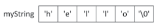

# C-Style Strings

In the C language, strings are represented as an array of characters. The last character of a string is a null character (`\0`) so that code operating on the string can determine where it ends. This null character is officially known as NUL, spelled with one L, not two.

For instance, the string literal `"hello"` is composed of five visible characters, but it occupies six characters in memory to accommodate the null terminator.



C-style strings are a legacy from the C language and are fully supported in C++ for backward compatibility. While C++ offers the more robust and safer `std::string` class, a solid understanding of C-style strings is essential. You will frequently encounter them when interfacing with C-based libraries or operating system APIs.

## Declaration and Initialization

You can declare a C-style string in several ways:

### Array Initialization

Here, `str` is an array of 6 characters, including the null-terminating character.

```c++
char str[] = "Hello";
```

Here, str is an array of 6 characters: `'H'`,` 'e'`, `'l'`, `'l'`, `'o'`, and `'\0'`.

You can also explicitly specify the size, but you must ensure it's large enough for the string and the null terminator.

```c++
char str[6] = "Hello";
```

### Pointer Initialization

You can use a character pointer to point to a string literal. String literals are typically stored in a read-only section of memory. Therefore, it is best practice to declare the pointer as const to prevent accidental modification, which would lead to undefined behavior.

```c++
const char* str = "Hello";
```

You do not need to delete a pointer that points to a string literal. You only `delete` (or `delete[]`) memory that you have allocated with `new` (or `new[]`).

The pointer `str` simply holds the memory address of the first character (`'H'`) of that static, read-only block of memory.

> [!TIP]
> If you're new to pointers & memory you can read more about pointers in the **Memory Management** section.

### Dynamic Allocation

For strings where the size is not known at compile time, you can dynamically allocate memory.
You can use a character pointer to point to a string literal.


```c++
char* dynamicStr = new char[50]; // Allocate space for 49 characters + null terminator
```

When you are finished with a dynamically allocated string, you are responsible for deallocating the memory to prevent memory leaks. Remember to use the delete[] operator for arrays.

```c++
delete[] dynamicStr;
```

String literals are typically stored in a read-only section of memory. Therefore, it is best practice to declare the pointer as const to prevent accidental modification, which would lead to undefined behavior.

## String Manipulation

The `<cstring>` header provides a suite of functions for manipulating C-style strings.

### Length (`strlen`)

This function returns the number of characters in a string, **excluding the null terminator**. It does this by counting characters until it finds `\0`.

```c++
const char* str = "Hello";
size_t len = strlen(str); // len will be 5
```

### Copy (`strcpy` and `strncpy`)

`strcpy` copies the source string to the destination, including the null terminator.

```c++
char dest[50];
const char* src = "World";
strcpy(dest, src);
```

Highly unsafe as it does not perform any bounds checking and can easily lead to buffer overflows.

A safer alternative is `strncpy`, which takes an additional argument for the maximum number of characters to copy. It offers some protection against buffer overflows.

```c++
char dest[5];
const char* src = "HelloWorld";
strncpy(dest, src, 4);
dest[4] = '\0'; // Manually add null terminator
```

### Concatenation (`strcat` and `strncat`)

`strcat` appends the source string to the end of the destination string.

```c++
char dest[50] = "Hello, ";
const char* src = "World!";
strcat(dest, src); // dest is now "Hello, World!"
```

`strcpy`, it is unsafe and can cause buffer overflows if the destination buffer is not large enough to hold the combined string.

The safer version is `strncat`, which appends a specified number of characters.

```c++
size_t bufferSize = 10;
char dest[bufferSize] = "Hello, ";
const char* src = "World!";

// Calculate how much space is TRULY available
size_t currentLength = strlen(dest); // This is 7
size_t spaceLeftForChars = bufferSize - currentLength - 1; // 10 - 7 - 1 = 2

// Now, use that calculated number
strncat(dest, src, spaceLeftForChars);
```

The final, safe result for `dest` would be `"Hello, Wo"`, and the memory would look like this:

```
'H'	'e'	'l'	'l'	'o'	','	' '	'W'	'o'	'\0'
```

### Comparison (`strcmp`)

This function compares two strings lexicographically.

```c++
const char* str1 = "apple";
const char* str2 = "apply";

if (strcmp(str1, str2) == 0) {
    // strings are equal
}
```

## Problems & Limitations

### 1. Buffer Overflow

C-style strings are susceptible to buffer overflows because functions like `strcpy` and `strcat` do not check for buffer size. This can lead to overwriting adjacent memory, causing undefined behavior or even security vulnerabilities.

Let's use a smaller, more dramatic example. Imagine your memory on the stack looks something like this. We'll place an important variable right next to our buffer.

```c++
void vulnerableFunction() {
    char dest[10];
    bool accessGranted = false; // Our important variable, right next to dest in memory

    // A malicious user provides this input string
    const char* src = "111111111BBBB"; // 13 characters + '\0'

    // What happens now?
    strcpy(dest, src);

    if (accessGranted) {
        // This should not happen!
        launch_the_missiles();
    }
}
```

When this overflow happens, one of the following things can occur:

- **Best Case**: Immediate Crash. The program tries to write to a memory address that is protected or invalid, and the operating system terminates it immediately with a "Segmentation Fault" or "Access Violation". This is the best outcome because you know something is wrong right away.
- **Common Case**: Bizarre Bugs. The program overwrites an adjacent variable. In our example, `accessGranted` is no longer `false`. Any non-zero value is treated as `true` in a boolean context. Suddenly, the `if (accessGranted)` check passes, and your program does something it was never supposed to. This is incredibly hard to debug because the crash or incorrect behavior might happen much later, far away from the original strcpy call.
- **Worst Case**: Security Exploit. This is how many viruses and remote attacks work. 

#### The Real C++ Solution: `std::string`

The modern C++ way is to abandon C-style character arrays for string manipulation and use the `std::string` class.

```c++
#include <string>

std::string dest = "Hello, ";
std::string src = "a very long string that will not cause any problems.";

dest += src; // It just works. The string resizes itself. No overflows.
```

### 2. Manual Memory Management

When you're dealing with dynamic string sizes, you have to manually allocate and deallocate memory using functions like `malloc()` and `free()` or `new` and `delete` in C++.

```c++
char *dynamicString = (char *)malloc(50);  // allocate 50 bytes
if (dynamicString == NULL) {
    // handle memory allocation failure
}
strcpy(dynamicString, "Hello, world!");
// ... some code ...
free(dynamicString);  // don't forget to free the memory
```

In this example, we allocate 50 bytes for `dynamicString`. We then copy "Hello, world!" into it. Finally, we free the memory. If you forget to free the memory, you'll have a memory leak.

### 3. Limited Functionality

C-style strings don't have built-in methods for operations like finding a substring, replacing characters, or other common string manipulations. You have to use external functions or write your own.

```c++
const char *haystack = "Hello, world!";
const char *needle = "world";
char *result = strstr(haystack, needle);
if (result) {
    printf("Substring found at position %ld\n", result - haystack);
} else {
    printf("Substring not found\n");
}
```

In this example, we use the `strstr` function from `<cstring>` to find a substring. Unlike languages with built-in string types that have methods for these operations, C-style strings require you to use external functions.

### 4. The Critical Nuance of Character Encoding (The UTF-8 Problem)

When dealing with UTF-8 (the dominant encoding for web and modern systems), a single visible character (a grapheme) can be composed of 1 to 4 bytes.

```c++
const char* s1 = "Hello";    // ASCII
const char* s2 = "Héllö";     // UTF-8
const char* s3 = "你好";       // UTF-8

// This output will surprise many developers:
cout << "strlen(s1): " << strlen(s1) << endl; // Output: 5
cout << "strlen(s2): " << strlen(s2) << endl; // Output: 7 (é is 2 bytes, ö is 2 bytes)
cout << "strlen(s3): " << strlen(s3) << endl; // Output: 6 (each character is 3 bytes)
```

## Summary

To understand the necessity of the C++ string class, consider the advantages and disadvantages of C-style strings.

### Advantages

- **Simplicity and Low-Level Control**: They are essentially character arrays, providing direct memory access.
- **Lightweight**: They have minimal memory overhead, consuming only the space for the characters and the null terminator.
- **C Compatibility**: They are essential for interoperability with C code.

### Disadvantages

- **Prone to Errors**: They are a common source of bugs, particularly buffer overflows and memory leaks.
- **Manual Memory Management**: Require careful handling of memory allocation and deallocation.
- **Lack of Object-Oriented Features**: They do not encapsulate string-related operations.

The fundamental issue is that C-style strings expose their underlying implementation, forcing the programmer to manage many low-level details. This complexity is a significant reason why modern C++ strongly favors the use of `std::string`.